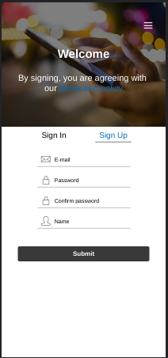

<h1>App Challenge NextIdea - Sprint 2</h1>

<h2>Diferenças para a Sprint 1</h2>

O que mudou da sprint atual para a sprint passada foi que não iremos treinar o chatGPT com uma base de dados, já que isso acabou se mostrando impossivel, existe outras IAs que podem ser treinadas, mas não o chatGPT.

<h2>Tecnologias utilizadas</h2>

O projeto foi codificado usando o React-Native e Expo.

<ul>
    <li>Expo-av</li>
    <li>Expo-Speech</li>
    <li>React-Navigation</li>
    <li>Axios</li>
    <li>React-Hook-Form</li>
    <li>Google Speech to Text</li>
</ul>

<h2>Telas</h2>
<h3>Tela Inicial</h3>

<h3>Menu</h3>

<h3>Tela Login</h3>

<h3>Tela Cadastro</h3>

